# 🗄️ Schema v2 — Base de datos profesional para Predictions_MX

> **Filosofía:** Capturar **todo lo scrapeable** + estructura para **enriquecer manualmente** (psicología, contexto) + datos derivados (features para ML).

**Fecha:** 2026-06-26
**Autor:** Predictions_MX (auto-generado bajo dirección de Ángel Padilla)
**Estado:** Borrador para validación

---

## 📊 Diagrama ER (Mermaid)

```mermaid
erDiagram
    LEAGUE ||--o{ SEASON : tiene
    SEASON ||--o{ FIXTURE : tiene
    LEAGUE ||--o{ FIXTURE : tiene
    LEAGUE ||--o{ TEAM : participan
    VENUE ||--o{ FIXTURE : sede
    VENUE ||--o{ TEAM : casa
    TEAM ||--o{ PLAYER : roster
    TEAM ||--o{ FIXTURE : local
    TEAM ||--o{ FIXTURE : visitante
    TEAM ||--o{ COACH : dirige
    COACH ||--o{ COACH_TENURE : historial
    SEASON ||--o{ COACH_TENURE : periodo
    FIXTURE ||--o{ FIXTURE_EVENT : tiene
    FIXTURE ||--o{ FIXTURE_STATISTIC : tiene
    FIXTURE ||--o{ FIXTURE_LINEUP : tiene
    FIXTURE ||--|| MATCH_WEATHER : clima
    FIXTURE ||--|| MATCH_CONTEXT : contexto
    PLAYER ||--o{ FIXTURE_LINEUP : juega_en
    PLAYER ||--o{ PLAYER_INJURY : historial
    PLAYER ||--o{ PLAYER_TRANSFER : transferencias
    TEAM ||--o{ TRAVEL_LOG : fatiga_viaje
    FIXTURE ||--o{ TRAVEL_LOG : previo_a
    TEAM ||--o{ TEAM_FORM : forma_reciente
    SEASON ||--o{ TEAM_FORM : temporada
    PLAYER ||--o{ PLAYER_FORM : forma_reciente
    SEASON ||--o{ PLAYER_FORM : temporada
    COACH ||--o{ COACH_FORM : forma_reciente
    SEASON ||--o{ COACH_FORM : temporada

    LEAGUE {
        int id PK
        string name
        string country
        string tier
        bool is_active
    }
    SEASON {
        int id PK
        int league_id FK
        string name
        datetime start_date
        datetime end_date
        bool is_current
    }
    VENUE {
        int id PK
        string name
        string city
        string state
        int altitude_m
        float latitude
        float longitude
        string surface
        int capacity
        string roof_type
        string climate_zone
    }
    TEAM {
        int id PK
        string name
        string short_code
        int founded
        int venue_id FK
        string logo_url
        string primary_color
        string secondary_color
    }
    COACH {
        int id PK
        string full_name
        string nationality
        date date_of_birth
        string tactical_style
        string formation_preference
        int years_experience
    }
    COACH_TENURE {
        int id PK
        int coach_id FK
        int team_id FK
        int season_id FK
        date start_date
        date end_date
        bool is_current
    }
    PLAYER {
        int id PK
        string full_name
        string first_name
        string last_name
        date date_of_birth
        string nationality
        string primary_position
        string secondary_position
        int height_cm
        int weight_kg
        string preferred_foot
        int shirt_number
        string photo_url
    }
    PLAYER_INJURY {
        int id PK
        int player_id FK
        date start_date
        date end_date
        string injury_type
        string body_part
        int games_missed
        string source
    }
    PLAYER_TRANSFER {
        int id PK
        int player_id FK
        int from_team_id FK
        int to_team_id FK
        date transfer_date
        float fee_amount
        string fee_currency
        string transfer_type
    }
    FIXTURE {
        int id PK
        int season_id FK
        int league_id FK
        int venue_id FK
        int home_team_id FK
        int away_team_id FK
        datetime starting_at
        string state
        string round
        int home_score
        int away_score
        int home_ht_score
        int away_ht_score
        int attendance
    }
    FIXTURE_EVENT {
        int id PK
        int fixture_id FK
        int team_id FK
        int player_id FK
        int minute
        int extra_minute
        string type
        string detail
    }
    FIXTURE_STATISTIC {
        int id PK
        int fixture_id FK
        int team_id FK
        string stat_type
        float stat_value
    }
    FIXTURE_LINEUP {
        int id PK
        int fixture_id FK
        int player_id FK
        int team_id FK
        bool is_starter
        bool is_captain
        string position_group
        string position_detail
        int shirt_number
        int minutes_played
        float rating
        int goals
        int assists
        int yellow_cards
        int red_cards
        bool was_substituted
    }
    MATCH_WEATHER {
        int fixture_id PK,FK
        float temperature_c
        float feels_like_c
        int humidity_pct
        float wind_kph
        float precipitation_mm
        string conditions
        string data_source
    }
    MATCH_CONTEXT {
        int fixture_id PK,FK
        int matchday
        int home_rest_days
        int away_rest_days
        bool is_derby
        bool is_classic
        int home_consecutive_home
        int away_consecutive_away
        float psychological_pressure_home
        float psychological_pressure_away
        string notes_manual
    }
    TRAVEL_LOG {
        int id PK
        int team_id FK
        int fixture_id FK
        float distance_km
        string transport_mode
        datetime departure_at
        datetime arrival_at
        int travel_hours
    }
    TEAM_FORM {
        int id PK
        int team_id FK
        int season_id FK
        date as_of_date
        int last_5_wins
        int last_5_draws
        int last_5_losses
        int last_5_goals_for
        int last_5_goals_against
        float avg_rating
        float momentum_score
    }
    PLAYER_FORM {
        int id PK
        int player_id FK
        int season_id FK
        date as_of_date
        int last_5_goals
        int last_5_assists
        int last_5_minutes
        float last_5_rating
        float fatigue_index
    }
    COACH_FORM {
        int id PK
        int coach_id FK
        int season_id FK
        date as_of_date
        int last_5_wins
        int last_5_draws
        int last_5_losses
        float pressure_index
        bool job_at_risk
    }
```

---

## 🆕 Tablas nuevas vs actuales

| # | Tabla | Estado | Descripción |
|---|---|---|---|
| 1 | `leagues` | ✅ existe | + tier |
| 2 | `seasons` | ✅ existe | — |
| 3 | `teams` | ✅ existe | + colores |
| 4 | `venues` | ✅ existe | **MEJORADA:** altitude_m, lat/lon, surface, climate_zone |
| 5 | `players` | ✅ existe | **MEJORADA:** preferred_foot, shirt_number, primary/secondary_position |
| 6 | `fixtures` | ✅ existe | + attendance |
| 7 | `fixture_events` | ✅ existe | — |
| 8 | `fixture_statistics` | ✅ existe | — |
| 9 | `coaches` | 🆕 NUEVA | **DT/Directores técnicos** |
| 10 | `coach_tenures` | 🆕 NUEVA | Historial de DT por equipo-temporada |
| 11 | `player_injuries` | 🆕 NUEVA | Historial de lesiones |
| 12 | `player_transfers` | 🆕 NUEVA | Transferencias entre equipos |
| 13 | `fixture_lineups` | 🆕 NUEVA | **Alineaciones con rating, minutos, posición táctica** |
| 14 | `match_weather` | 🆕 NUEVA | **Clima del partido** (temp, humedad, viento, lluvia) |
| 15 | `match_context` | 🆕 NUEVA | **Contexto especial:** derby, descanso, presión psicológica |
| 16 | `travel_log` | 🆕 NUEVA | **Fatiga por viaje** (distancia, modo, duración) |
| 17 | `team_form` | 🆕 NUEVA | Forma reciente agregada del equipo (calculable) |
| 18 | `player_form` | 🆕 NUEVA | Forma reciente del jugador (calculable) |
| 19 | `coach_form` | 🆕 NUEVA | Forma reciente del DT (calculable) |
| 20 | `analyst_predictions` | 🆕 AGREGADA | Bitácora de predicciones del analista (Sesión 2, con `--no-log` desactivado) |

**Total: 20 tablas** (8 mejoradas + 12 nuevas / agregadas)

---

## 📦 Datos scrapeables vs manuales

### ✅ Scrapeable automáticamente (SportMonks v3):
- Coaches (endpoint `/coaches`)
- Coach tenures (endpoint `/coaches/{id}?include=teams`)
- Player injuries (incluido en `/fixtures/{id}?include=lineups`)
- Player transfers (endpoint `/transfers`)
- Fixture lineups (incluido en `/fixtures/{id}?include=lineups`)
- Stadium altitude/coords (SportMonks + Wikipedia/manual)
- Attendance (SportMonks)
- Stats básicas

### ⚠️ Necesita API externa:
- **Match weather:** Open-Meteo (gratis, sin API key) o OpenWeather (con key)
- **Stadium altitude/coords:** Wikipedia + GeoNames
- **Stadium surface:** Manual o scraping

### 🤖 Calculable (desde stats scrapeadas):
- `team_form`: aggregate últimos 5 partidos
- `player_form`: aggregate últimos 5 partidos del jugador
- `coach_form`: aggregate últimos 5 partidos del DT
- `travel_log`: distancia calculada entre venues de local y visitante anterior
- `match_context.home_rest_days` / `away_rest_days`: diff entre fixtures
- `match_context.is_derby` / `is_classic`: lista manual de derbies (se puede definir como config)
- `match_context.home_consecutive_home`: contar fixtures consecutivos en casa

### ✍️ Manual / curación humana:
- `match_context.psychological_pressure_home/away`: análisis de prensa/momento del equipo
- `match_context.notes_manual`: observaciones del analista
- Stadium surface / roof_type: cuando no esté en SportMonks

---

## 🛡️ Estrategia de migración (sin perder datos)

**Problema:** tenemos 3,081 fixtures + 53,770 eventos + 192,370 stats ya cargados.

**Plan:**
1. **Backup de la BD actual** → `data/predictions_mx.v1_backup.db`
2. **Crear schema v2** con todas las tablas nuevas y mejoras
3. **Migrar datos preservando lo existente** vía script Python:
   - `leagues`, `seasons`, `teams`, `players`, `venues`, `fixtures`, `fixture_events`, `fixture_statistics` → copiar 1-a-1, agregando campos nuevos como NULL
   - Tablas nuevas → vacías, listas para ingestar
4. **Validar conteos** post-migración
5. **Iniciar ingestas de tablas nuevas** (coaches, lineups, weather, etc.)

---

## ⏱️ Estimación de esfuerzo

| Tarea | Tiempo |
|---|---|
| Diseño del schema (este doc) | ✅ hecho |
| Implementar schema v2 en SQLAlchemy | 1-2h |
| Script de migración preservando datos | 1h |
| Ingesta de coaches + tenures | 30 min |
| Ingesta de lineups (de las 10 temporadas) | 1-2h |
| Ingesta de injuries | 30 min |
| Ingesta de transfers | 30 min |
| Enriquecer stadiums (altitud, coords) | 2-3h (manual para Liga MX, son ~20-30 estadios) |
| Ingesta de weather histórica | 2-3h (Open-Meteo, 3,081 fixtures × 1 call) |
| Calcular team_form / player_form / coach_form | 1-2h |
| Calcular travel_log + match_context básico | 1h |
| **TOTAL estimado** | **~12-15 horas de trabajo** |

---

## ❓ Decisiones pendientes (necesito tu input)

1. **¿Quieres que use Alembic** para migraciones (estándar profesional) o **scripts Python one-shot** (más rápido, menos dependencias)?
2. **¿Weather API gratis (Open-Meteo)** o **API de pago** (más confiable)?
3. **¿Stadium enrichment: Wikipedia scraping** (gratis, lat/lon OK, altitud puede faltar) o **manual con tabla** (más preciso pero requiere tu tiempo)?
4. **¿Implementar todo de golpe o por fases?** Sugiero:
   - **Fase 1 (HOY):** schema + migración + coaches/lineups (lo más valioso)
   - **Fase 2 (MAÑANA):** weather + stadiums
   - **Fase 3:** injuries, transfers, forms calculadas
   - **Fase 4:** travel_log, match_context calculado
5. **Para los datos manuales** (psicología, contexto): ¿prefieres que te arme una **interfaz CLI** tipo `python3 src/add_context.py --fixture 12345` para que tú captures o un **formato JSON/YAML** por temporada?

---

## 🎯 Lo que desbloquea este schema

Con esta BD, cuando lleguemos al modelo predictivo podemos calcular features como:

- **Forma reciente:** `team_form.last_5_wins`, `player_form.last_5_goals`
- **Fatiga:** `travel_log.travel_hours + match_context.rest_days`
- **Localía:** `match_context.home_consecutive_home + venue.altitude_m`
- **Clima:** `match_weather.temperature_c + humidity_pct` (afecta rendimiento)
- **Psicología DT:** `coach_form.pressure_index + job_at_risk`
- **Moral jugador:** `player_form.fatigue_index + player_injuries.games_missed_recent`
- **Contexto:** `is_derby + psychological_pressure_home/away`

**Esto convierte tu modelo de "predicción básica de goles" a un modelo contextual estilo el que usan casas de apuestas profesionales.** 🎯

---

¿Qué te late? ¿Vamos Fase 1 ya? ¿O quieres ajustar el diseño antes? 🚀